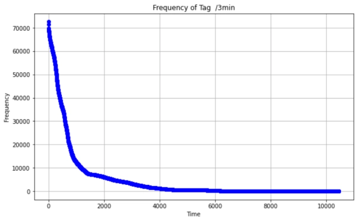
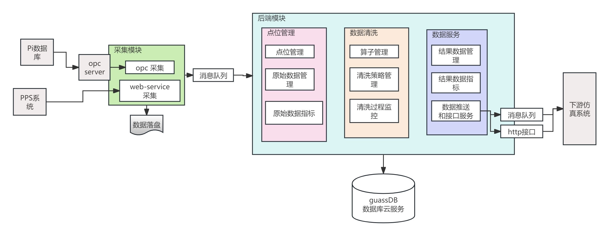
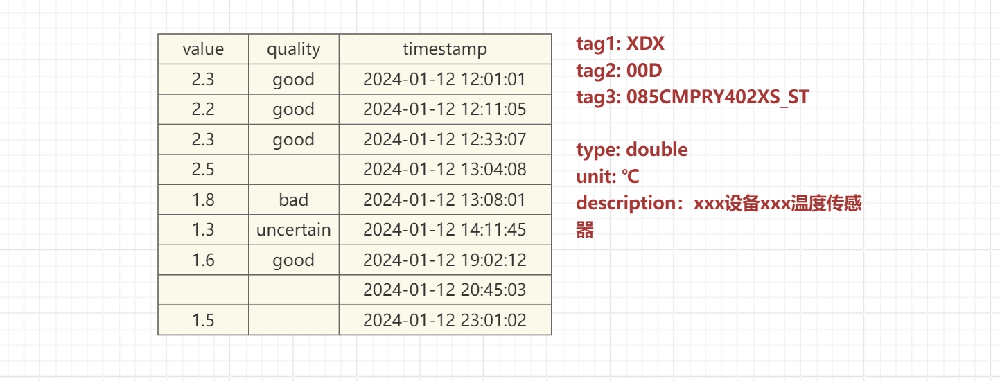
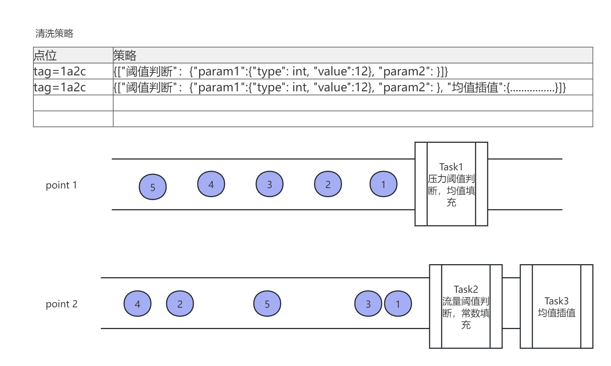
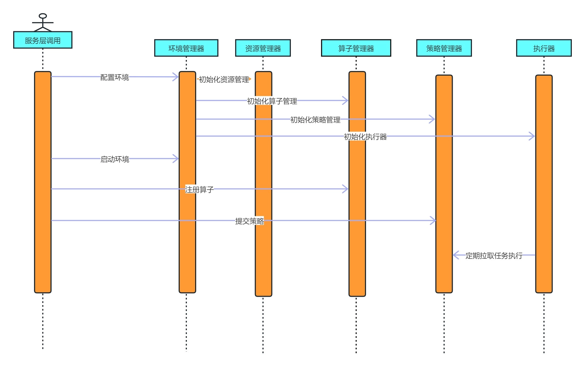

# 油气管道物联网时序数据清洗平台技术白皮书
## 1. 项目背景

### 1.1 行业现状

油气管道是全球能源输送的核心基础设施。一条干线管道通常绑定数千至上万个传感器测点，覆盖压力、温度、流量、振动、阀门状态、阴极保护电位等多种物理量，以每秒到数秒的频率持续产生监测数据。这些数据经由PLC采集、OPC协议传输、SCADA系统汇聚，最终存入OSIsoft PI等实时历史数据库，构成了管道安全运行和调度决策的数据基础。

随着管道建设规模的扩大和数字化转型的推进，传感器部署密度和采集频率持续提高。以本项目所服务的管道公司为例，其监控系统覆盖超过500万个传感器测点，按每5秒全量采集计算，日均产生约129.6 GB的原始数据。这些数据需要支撑管道完整性管理、泄漏检测、设备状态监控、调度优化和应急决策等多个下游业务系统。

### 1.2 当前的痛点

在与管道公司信息化部门的深入沟通中，我们识别出三个核心痛点。

数据质量直接影响决策可靠性 原始传感器数据中普遍存在异常值和缺失值。异常值主要来源于传感器精度漂移、电磁干扰和设备瞬时故障；缺失值则由传感器故障、通信链路中断或部分位置未安装传感器导致。在油气管道场景下，一个未被识别的压力异常值可能触发误报警，一段未被修复的流量缺失可能导致泄漏检测模型失效。甲方迫切需要在数据进入下游系统之前，对其进行系统化的清洗处理。

存储成本持续增长 现有系统采用固定间隔全量采集和存储策略，无论数据是否发生变化都会记录。但管道运行的实际情况是，大部分测点在大部分时间内处于稳态——管壁温度不会每5秒变一次，累计流量的变化也远低于采集频率。这意味着存储系统中积累了大量冗余数据，不仅占用存储空间，还拖慢了历史数据查询的响应速度。按当前增长趋势，半年的数据累积量将接近19.4 TB，给存储基础设施带来持续压力。

缺乏轻量可控的数据处理能力 甲方现有的数据处理依赖PI系统内置的有限规则和离线批处理脚本，缺乏一套独立的、可灵活配置的实时数据清洗平台。市面上基于Flink、Spark等通用框架的方案部署复杂、运维成本高，与甲方信息化团队的技术栈和运维能力不匹配。

### 1.3 项目目标

基于上述痛点，本项目的目标是为管道公司设计并交付一套实时时序数据清洗平台，具体要求包括：

- 从PI数据库实时接入全量传感器数据，完成异常检测、缺失修复和冗余消除
- 清洗吞吐量满足万级测点、秒级延迟的实时处理需求
- 通过优化存储策略显著降低数据存储成本
- 清洗规则和算法可由甲方运维人员灵活配置和开发
- 系统部署简单，可以轻量化部署运行
- 具备生产级的可靠性，支持7×24小时无人值守运行


## 2. 需求分析与技术挑战

### 2.1 数据接入特征

本系统的数据源是管道公司已部署的OSIsoft PI实时历史数据库。PI系统通过OPC协议从SCADA系统接收全部传感器数据，是管道监控体系中数据最集中、最完整的汇聚点。我们的系统从PI的OPC Server实时订阅数据，这意味着数据接入呈现以下特征：

**数据流集中且持续** 所有测点的数据从单一数据源（PI数据库）流入，不存在多源异构接入的问题，但数据流量大且不间断。按500,000个测点、每5秒采集一次计算，系统每秒需要处理约2,091个数据点的持续流入，峰值时段（如工艺调整、设备联动）数据量可能达到正常值的2—3倍。

**数据格式固定且已知** 每个数据点的结构是确定的三元组：观测值（Value）、质量码（Quality）和时间戳（Timestamp）。测点的元数据（名称、单位、量程、工程含义）在系统初始化时即可从PI系统获取，运行期间不会频繁变化。这一特征对后续的存储设计和计算模型选择产生了重要影响——我们不需要应对Schema变更、嵌套结构或非结构化数据，可以围绕这个简单固定的数据结构做极致优化。

**数据自带质量标记** PI系统为每个数据点附带质量码，标记数据的可靠性状态（如正常、可疑、设备故障、通信中断等）。这为我们的清洗逻辑提供了额外的判断依据——质量码异常的数据可以直接标记处理，无需完全依赖数值层面的异常检测。

### 2.2 数据变化频率的分布发现

在项目初期，我们对管道公司一年的历史运行数据进行了深入分析，目的是摸清数据的实际变化规律，为存储和清洗策略的设计提供依据。这次分析揭示了一个关键发现：

**绝大多数测点在绝大多数时间内并不发生有意义的数值变化。**

具体的分布如下：

| 类别   | 变化频率       | 测点占比   | 典型物理量         |
| ---- | ---------- | ------ | ------------- |
| 高活跃  | 每5秒内可能变化多次 | 约3.0%  | 管道压力、瞬时流量     |
| 中等活跃 | 5秒到3分钟变化一次 | 约6.2%  | 介质温度、部分水质参数   |
| 低活跃  | 超过3分钟才变化一次 | 约90.8% | 环境温度、累计量、阀门状态 |



这意味着在现有的每5秒全量采集策略下，系统产生的数据中有大量冗余——一个环境温度测点可能一小时内都保持同一个数值，但系统仍然每5秒忠实地记录一次。这720条记录中，真正携带新信息的可能只有几条。

这一发现直接驱动了后续两个核心设计决策：存储层的逢变才存压缩策略（第5.3节），以及缓存层针对不同活跃度测点的差异化管理（第5.5节）。

### 2.3 三类数据质量问题

通过对历史数据的分析和与甲方运维团队的沟通，我们将管道场景下的数据质量问题归纳为三类。

**数据异常** 传感器观测值偏离了其应有的物理状态。在管道场景中，典型的异常包括：压力传感器因电磁干扰产生的瞬时尖峰、温度传感器精度漂移导致的读数缓慢偏移、设备重启瞬间输出的无效零值或满量程值。这类异常如果不清洗，直接传递给下游的泄漏检测或设备健康管理模型，可能导致误报警或漏报警。

**数据缺失** 在预期的采集时刻未收到有效数据。原因包括传感器故障离线、通信链路临时中断、或个别管段尚未安装对应传感器。对于管道安全监控而言，数据缺失本身就是一个需要关注的信号，同时下游分析模型也通常要求输入数据在时间轴上是连续的，因此需要根据预设规则对缺失区间进行合理填充。

**数据冗余** 即2.2节分析揭示的问题——固定频率采集导致大量无变化数据被重复记录。这不直接影响数据正确性，但造成存储浪费和查询效率下降。

三类问题的处理优先级不同：异常数据直接威胁决策安全性，优先级最高；数据缺失影响分析模型的完整性，优先级其次；数据冗余影响存储成本和查询性能，属于优化项。系统设计需要同时覆盖这三类问题，同时给下游供数的时候，要把当前时刻的所有数据时间戳对齐。

### 2.4 技术挑战

将上述需求转化为系统设计时，我们面临以下具体的技术挑战。

**实时性与处理质量的平衡** 清洗处理必须在数据到达后尽快完成，不能成为数据链路的瓶颈。但更精确的清洗算法通常意味着更大的计算开销。我们需要找到一个计算模型，既能保证秒级以内的处理延迟，又能提供足够的清洗质量。

**高频写入与存储效率的矛盾** 系统每秒接收约500,000个数据点，清洗后的数据需要及时持久化存储。如果每个数据点都同步写入磁盘，I/O开销会成为系统瓶颈；如果纯靠内存缓存，又面临故障时的数据丢失风险。需要一套机制在写入性能、存储效率和数据安全之间取得平衡。

**清洗策略的多样性与可配置性** 不同物理量的异常模式和处理方式差异很大——压力信号的异常判定逻辑和温度信号完全不同，瞬时流量的缺失填充策略和累计量也不一样。系统不能硬编码清洗规则，需要提供一个灵活的框架，让不同的清洗算法能够自由组合和配置，并且支持运行时调整。

**生产环境的可靠性要求** 管道监控是7×24小时不间断业务，系统必须具备故障自恢复能力，不能因为单点故障导致数据处理中断或数据丢失。同时，系统的部署和运维必须足够简单，不能给甲方运维团队带来额外负担。


## 3. 技术选型与设计决策

系统设计之初，我们面临一系列关键的技术选型决策。每个决策都是在充分评估业务场景、技术约束和运维成本后做出的。本章记录这些决策过程和背后的权衡逻辑。

### 3.1 核心决策：自研轻量级清洗框架

**备选方案评估** 在项目启动阶段，我们评估了三条技术路线：基于Apache Flink构建清洗管道、基于Apache Spark Streaming构建清洗管道、以及自研一套面向时序数据清洗的专用计算框架。

**放弃通用流处理框架的理由** Flink和Spark Streaming都是经过大规模验证的优秀框架，但它们是为通用流处理场景设计的。通用意味着它们支持了复杂的窗口语义、精确一次性保证、动态Schema处理、多源异构数据接入、复杂的状态管理和分布式协调等能力。这些能力在很多场景下是必要的，但在我们的场景下构成了不必要的负担。

我们的场景有几个明确的特征使得通用框架显得过重。数据格式固定且已知，每个数据点就是值、质量码、时间戳三个字段，不存在Schema变更和嵌套结构的问题。数据源单一，所有数据从PI数据库一个入口进来，不需要多源数据融合。清洗逻辑是测点级别的独立处理，不同测点之间的清洗任务没有复杂的依赖关系。处理模式是固定周期的微批触发，不需要事件驱动的复杂窗口语义。

引入Flink或Spark意味着，部署时需要搭建和维护一套分布式集群（JobManager/TaskManager或Driver/Worker），运行时需要承担序列化反序列化、Checkpoint、分布式状态同步等机制的资源开销，运维时需要甲方团队掌握这些框架的监控和调优技能。这些代价对我们的场景来说，投入产出比不合理。

**自研框架的设计** 我们选择自研的核心逻辑是：**需求收口足够窄，场景足够特化，值得用一套最简设计换取部署和运维上的极致简单** 具体的设计目标包括：

- 一个安装包、一条命令完成部署启动，不依赖外部集群环境
- 所有清洗逻辑通过算子组合实现，甲方运维人员可自行配置调整
- 状态监控和运行管理完全内置，不依赖第三方监控系统
- 在单节点上即可支撑百万级测点的实时清洗，满足当前业务规模


### 3.2 消息队列：选Kafka

数据从PI数据库到清洗模块之间需要一个缓冲层，用于解耦采集与计算的速率差异，并在故障场景下提供数据暂存能力。我们评估了Kafka、RabbitMQ和MQTT Broker三种方案。

**Kafka胜出** 我们的数据流有两个突出特征：数据从PI数据库集中流入，流量大且持续。这恰好是Kafka最擅长的场景——高吞吐、持久化的顺序消息流。Kafka基于磁盘顺序写入的设计使其在大流量场景下的吞吐量远超基于内存的消息队列。同时，Kafka的消息持久化和可回溯消费能力为我们的灾备设计提供了天然支撑——备用实例可以独立消费同一个Topic，主实例故障后备用实例能够从断点继续处理。

**RabbitMQ和MQTT不适合** RabbitMQ更适合需要复杂路由和消息确认机制的场景，其设计重点在于消息投递的灵活性而非吞吐量，在我们这种大流量顺序消费的场景下优势不明显。MQTT是面向物联网终端设备的轻量级协议，适合设备端到云端的数据上报，但我们的数据已经汇聚在PI数据库中，不需要处理设备端的连接管理和协议适配问题，用MQTT反而增加了不必要的协议层。

### 3.3 本地存储：选SQLite3

清洗后的数据需要持久化存储，同时系统的运行状态、任务配置和日志信息也需要本地存储，我们选择SQLite3作为存储引擎。

**选择SQLite3的核心逻辑** 我们的数据有一个关键特征：格式固定、查询模式单一。每个测点的数据就是按时间排列的三元组序列，几乎所有查询都是"给定测点、给定时间范围、返回这段时间内的数据"。这个查询模式只需要一个维度的索引——时间戳。

基于这个特征，我们设计了一套围绕SQLite文件的存储方案。每个测点对应独立的数据表，按时间窗口分库分表，每张表在时间戳字段上建立B-tree索引。底层存储就是SQLite文件，系统在其上层建立了一套基于元数据的管理机制，负责分表路由、文件生命周期管理和冷热数据迁移。

这个方案的优势非常明显。部署零依赖，SQLite是嵌入式数据库，不需要独立的数据库服务进程，随应用启动即可用。运维零成本，没有连接池管理、没有数据库配置调优、没有独立的备份恢复流程，数据文件本身就是备份单元。性能可控，一点一表的设计消除了大表的写入锁竞争，时间戳索引保证了范围查询的效率，SQLite自身的存储格式还提供了不错的数据压缩效果。与系统设计哲学一致，整个系统就是一个安装包，存储层也不应该引入额外的外部依赖。

**为什么不选时序数据库** 时序数据库（如InfluxDB、TimescaleDB）是时序数据存储的专业方案，但引入独立的数据库服务与我们一键部署的设计目标冲突。Redis等内存数据库能提供更高的读写速度，但无法满足持久化存储需求且内存成本较高。在分布式部署模式下，系统支持切换到GaussDB等企业级数据库作为存储后端，但本地SQLite方案始终作为默认选项保留，确保最简部署场景下系统的完整可用。

### 3.4 整体架构风格：核心层与服务层分离

在系统的整体架构风格上，我们采用了核心层与服务层分离的设计。

**核心层**是系统的运行时引擎，包含运行时环境管理、算子管理、任务管理、任务执行、资源管理和数据存储六个组件。核心层专注于数据处理的执行效率和运行可靠性，对外暴露的是一组编程接口（API），不直接与用户交互。

**服务层**构建在核心层之上，提供RESTful接口和管理界面，支持测点管理、清洗任务配置、运行状态监控、告警通知和数据分发等面向用户的功能。

做这个分离的目的是让核心计算引擎保持稳定和高效，不受上层业务逻辑变化的影响。甲方未来如果需要调整管理界面、对接新的下游系统或增加新的运维功能，只需要在服务层做扩展，不需要触碰核心层的代码。同时，这种分离也使得核心层可以独立进行性能测试和优化，不受服务层复杂度的干扰。

### 3.5 技术选型总览

将上述决策汇总如下：

|决策项|选型结果|核心理由|
|---|---|---|
|计算框架|自研微批算子框架|场景特化、部署极简、运维可控|
|消息队列|Apache Kafka|高吞吐、持久化、支持多消费者灾备|
|本地存储|SQLite3 + 分库分表|零依赖、格式固定查询单一、文件即备份|
|分布式存储（可选）|GaussDB|企业级可靠性、甲方既有技术栈|
|数据采集协议|OPC UA/DA|PI系统标准接口、工业领域通用|
|架构风格|核心层/服务层分离|引擎稳定性与业务灵活性解耦|


## 4. 系统架构总览

### 4.1 整体架构

系统由八个模块组成：数据采集、数据传输、数据存储、计算清洗、任务调度、资源管理、灾备扩容和数据分发。这八个模块分布在核心层和服务层两个层次中，通过标准化接口和Kafka消息队列实现松耦合连接。

数据在系统中的流转路径如下：OPC采集模块从PI数据库实时订阅传感器数据，采集到的数据同时走两条路径——通过Kafka推送至清洗模块进行实时处理，同时写入本地SQLite进行持久化备份。清洗模块从Kafka消费数据后加载到内存缓存，按微批周期触发算子管道执行清洗计算，清洗结果写入缓存并异步持久化到存储层。最终，清洗后的高质量数据通过数据分发模块向下游业务系统输出。



### 4.2 核心层组件

核心层是系统的运行时引擎，包含六个组件，各自职责清晰。

**运行时环境（Environment）** 系统的骨架和生命周期管理者，负责初始化和协调其他五个组件。采用构建者模式支持链式配置，提供统一的系统启动入口。所有组件的创建顺序、依赖注入和启动时序由Environment统一控制，确保系统以正确的状态进入运行。

**算子管理器（FunctionManager）** 系统的算子注册表，负责清洗算子的注册、卸载、查询和参数验证。算子通过反射机制动态加载，支持运行时热更新。算子管理器维护每个算子的元数据信息（名称、版本、参数定义），为任务配置时的参数校验提供依据。

**任务管理器（TaskManager）** 系统的调度中枢，负责清洗任务的创建、状态跟踪和生命周期管理。每个任务对应一个测点的完整清洗管道定义，包括输入测点标识、算子管道配置（哪些算子、什么顺序、各自的参数）和调度参数。任务管理器维护所有任务的运行状态，为任务执行器提供待执行任务列表。

**任务执行器（TaskExecutor）** 系统的执行引擎，负责任务的实际运行。按微批周期从任务管理器拉取任务，执行前置检查（任务状态、输入数据有效性、算子参数合规性），通过后驱动算子管道执行清洗计算，执行后收集统计信息并处理异常。执行器内部通过线程池实现任务级并行，最大化利用计算资源。

**资源管理器（ResourceManager）** 系统的资源守护者，实时监控CPU、内存和缓存的使用情况。当检测到某个任务占用资源异常（如执行超时、内存占用过高）时，主动终止该任务以保护系统整体稳定性。资源管理器的监控数据同时上报给服务层，供运维监控界面展示。

**数据存储器（DataStorage）** 系统的数据持久化层，提供测点数据的写入和查询能力。对上层暴露统一的存储接口，底层默认由SQLite引擎实现，通过切换数据库适配层即可对接GaussDB等企业级数据库。存储器内部实现了分库分表路由、时间戳索引管理和"逢变才存"压缩逻辑。

### 4.3 服务层功能

服务层构建在核心层接口之上，提供面向用户和外部系统的交互能力。

**测点管理** 支持测点的新增、删除、修改和批量导入，管理测点的元数据信息（名称、单位、量程、所属管段、死区参数等）。

**任务配置** 提供可视化的清洗任务配置界面，运维人员可以为每个测点或测点组选择清洗算子、调整算子参数、设定算子执行顺序，配置完成后任务即刻生效，无需重启系统。

**运行监控** 实时展示系统的运行状态，包括各测点的数据流入速率、清洗任务的执行状态和耗时统计、缓存和存储的使用情况、以及系统资源的占用水平。异常事件（任务失败、资源告警、数据中断）通过告警通知机制及时推送。

**数据分发** 清洗后的数据通过多种方式向下游输出：Kafka Topic推送供实时消费方订阅，RESTful API供按需查询，文件导出供离线分析使用。

### 4.4 模块间协作关系

八个模块之间的协作遵循几个明确的原则。

**单向数据流** 数据在系统中的主路径是单向的：采集 → 传输 → 缓存 → 计算 → 存储 → 分发。不存在模块间的循环依赖，任何一个模块的处理结果只向下游传递，不回流到上游模块。这使得系统的数据流转逻辑清晰可追踪，故障排查时可以沿链路逐段定位。

**控制与数据分离** 数据流走Kafka和内存缓存的快速通道，控制指令（任务启停、参数变更、资源调整）走核心层内部的接口调用。两条路径互不干扰，控制操作不会阻塞数据处理，数据高峰也不会影响管理指令的响应。

**故障隔离** 各模块在设计上保持独立的错误边界。采集模块无法连接PI时，数据停止流入但清洗模块继续处理缓存中的存量数据。某个测点的清洗任务执行异常时，只影响该测点，不波及其他测点的正常处理。存储层写入失败时，数据在缓存中暂存，待存储恢复后通过异步写回补齐。


## 5. 关键技术设计


### 5.1 数据采集与传输

**采集模块的设计** 系统通过标准OPC UA/DA Client接口与PI数据库的OPC Server建立连接，以数据订阅的方式实时获取传感器数据。相比轮询方式，订阅模式由数据源主动推送变更数据，减少了无效的网络交互，也降低了对PI系统的查询压力。

采集模块支持动态点位管理和批量订阅。系统启动时根据任务配置批量订阅所需测点，运行期间可以动态增删订阅点位而无需重启采集连接。批量订阅机制将多个点位的订阅请求合并为一次网络交互，有效降低了OPC通信开销。

**双路并行传输** 采集到的数据同时走两条路径。主路径通过Kafka消息队列实时推送至清洗模块，保证数据处理的低延迟。Kafka的Topic按数据来源进行分区，保证同一测点的数据在分区内有序，支持下游消费者的并行处理。备路径将数据写入本地SQLite进行持久化存储，作为灾备兜底。当Kafka不可达时（如网络中断），数据在本地持续累积；网络恢复后，系统自动将本地积压的数据按时间顺序回补至Kafka，确保不丢不漏。

这个双路设计的本质是用本地磁盘的可靠性为网络传输的不确定性兜底。在油气管道场景下，数据丢失的代价远大于存储一份本地副本的成本，这个权衡是明确的。

### 5.2 逢变才存存储策略

 第2.2节的数据分析表明，90.8%的测点属于低频变化类，大部分时间内数值保持不变。如果仍按每5秒全量存储，系统中超过70%的存储记录是冗余的——它们不携带任何新信息。逢变才存策略的目标就是消除这些冗余，只在数据发生有意义的变化时才触发存储。
 

**死区判定机制** 系统为每个测点配置一个死区参数（Deadband），定义有意义的变化的最小阈值。当新到达的数据点与上次存储的数据点之间的差值绝对值小于死区时，认为数据未发生有意义的变化，不触发存储。死区参数根据测点的物理特性配置：管道压力等关键快变参数设置较小的死区甚至取消死区，确保数据完整性；环境温度等缓变参数设置较大的死区，最大化压缩效果。

除了数值变化判定外，系统还有两条补充规则。第一，即使数据长时间不变，系统也按最大静默间隔强制记录一次数据点。这条规则有两个作用：保持数据在时间轴上的连续性，同时作为测点存活的心跳信号——如果超过最大静默间隔仍无数据记录，下游系统可以据此判断测点可能离线。第二，当数据点的质量码发生变化时，无论数值是否变化，都触发存储。因为质量码的变化本身携带了重要的设备状态信息。

**压缩效果** 在实际运行中，该策略将整体存储数据量减少了约72%，同时保留了数据的有效信息。不同类别测点的压缩效果差异显著：低活跃测点的压缩率接近%，是存储优化的主要贡献者；高活跃测点的压缩率约为28%，这是符合预期的，因为这些测点本身就在频繁变化。

**一点一表的分表设计** 存储层为每个测点创建独立的数据表，每张表仅包含Value、Quality和Timestamp三个字段，在Timestamp上建立B-tree索引。表按时间窗口分库，过期的库文件可以整体归档或删除，管理粒度清晰。

这个设计放弃了传统大表的做法，换来了几个实际好处：不同测点的写入完全并行、互不阻塞；单表数据量可控，索引效率稳定不退化；按测点粒度实施权限控制和数据归档变得很自然；底层就是SQLite文件，文件本身就是备份和迁移的最小单元。

### 5.3 算子管道计算模型

算子是系统清洗逻辑的最小执行单元。每个算子封装一种特定的时序数据处理方法，实现统一的接口规范，接受参数化配置。算子的设计目标是让清洗逻辑像积木一样可以自由拼装——甲方运维人员不需要写代码，只需要选择算子、配置参数、指定执行顺序，就能组装出适合自己测点的清洗管道。

每个算子在实例化时接受三种类型的参数：数值型（如阈值上下限、滑动窗口长度）、字符串型（如替换策略名称）和枚举型（如插值方法选择）。参数在任务配置时设定，运行时通过算子上下文（OperatorContext）读取。算子通过上下文与系统交互，获取输入数据、读取参数、查询历史数据和写入输出结果，不直接依赖系统的任何内部实现。



**系统预置的四类算子** 基于管道监控场景的实际需求，系统预置了四类常用算子。

阈值检测算子，基于预设的上下限范围检测异常值。超出范围的数据点根据配置策略进行替换，支持固定值替换、临近有效值替换和滑动窗口均值替换三种模式。这是最基础也是最高效的异常检测手段，对管道压力的突发尖峰、传感器重启瞬间的无效零值等脉冲型异常效果显著。

插值填充算子，对检测到的数据缺失区间执行补全。支持线性插值、零阶保持（用缺失前最后一个有效值填充）和三次样条插值三种方法。可根据缺失时长自动选择策略——短时间缺失用线性插值，长时间缺失用零阶保持，避免过度插值引入失真。

滤波平滑算子，基于滑动窗口对时序数据进行噪声平滑。支持简单移动平均、指数加权移动平均（EWMA）和中值滤波三种模式。中值滤波对孤立脉冲噪声的抑制效果尤其好，EWMA则在平滑性和响应速度之间提供了可调节的平衡。

统计检测算子，基于时间窗口内的统计特征进行异常检测。计算窗口内的均值和方差，将偏离均值超过指定倍数标准差的数据点标记为异常。这类算子对传感器精度漂移等渐变型异常有较好的检测能力。

**算子管道的组合** 多个算子按指定顺序串联组成一个测点的完整清洗管道。数据从管道入口流入，依次经过每个算子处理后从出口流出。一个典型的管道配置是：阈值检测 → 插值填充 → 滤波平滑，依次完成异常值过滤、缺失补全和噪声平滑。不同测点可以配置不同的管道——关键压力测点可能只需要阈值检测，环境温度测点可能需要完整的三级管道。

**算子的动态加载** 算子通过反射机制在运行时动态加载到执行环境中，支持热更新。当甲方需要新增一种清洗逻辑时，只需按接口规范开发新算子、注册到算子管理器即可立即使用，不需要重启系统或重新部署。这个机制为系统的持续演进提供了扩展能力。

**微批执行模式** 系统按固定时间间隔（默认500毫秒）触发一轮全量任务的并发执行。每轮执行时，任务执行器从任务管理器拉取所有活跃任务，对每个任务执行前置检查（任务状态、输入数据有效性、算子参数合规性），检查通过后驱动算子管道执行清洗计算。所有任务在线程池中并行执行，单轮计算完成后收集统计信息，等待下一轮触发。

选择500毫秒作为默认微批间隔是一个刻意的权衡。更短的间隔意味着更低的延迟，但也意味着更频繁的调度开销和更多的上下文切换。在管道监控场景下，传感器的基础采集周期是5秒，500毫秒的处理延迟远小于数据的到达间隔，对下游系统来说感知不到延迟。同时，500毫秒的间隔留出了足够的时间窗口来积累数据和批量处理，提升了吞吐效率。这个参数可配置，范围从100毫秒到5000毫秒，甲方可根据实际需求调整。

### 5.4 多级缓存机制

清洗计算需要频繁读取测点的最新数据和近期历史数据。如果每次计算都从SQLite读取，磁盘I/O会成为瓶颈，系统吞吐量将大幅下降。同时，清洗结果需要及时持久化，如果每次计算都同步写入磁盘，写I/O同样会拖慢整个处理链路。因此，系统需要一套缓存机制在内存中暂存热点数据，减少对磁盘的直接依赖。

但物联网时序数据的缓存设计不能照搬通用数据库的LRU策略。时序数据有两个特殊性：第一，数据访问具有强时间局部性，计算任务几乎只关心最近一段时间的数据，历史数据一旦被计算消费过就不会再被访问；第二，不同测点的访问频率差异悬殊，高活跃测点每秒都有新数据到达，低活跃测点可能几分钟才变化一次。LRU策略无法有效利用这两个特征，可能导致低活跃测点的冷数据长期占据缓存空间，挤出真正需要的热点数据。


基于这些分析，我们设计了一套多级缓存机制，从四个层面解决问题。

**第一层：点位级缓存生命周期管理** 系统为每个活跃测点在内存中维护一个数据缓存实体。每个缓存实体持有一个生命值（TTL），初始为满值N。每当计算任务使用了该测点的数据，生命值重置为N；每个微批周期结束后，未被访问的测点生命值减1。当生命值降至0时，该测点缓存被标记为待淘汰。

这个机制的效果是：持续参与计算的热点测点始终驻留内存；长期未被访问的冷测点被逐步清退，腾出内存空间。生命值N的设定相当于给每个测点一个"宽限期"——不会因为偶尔一轮没被访问就立即淘汰，但也不会让不再使用的测点无限占用内存。

**第二层：时间窗口滑动淘汰** 即使是驻留内存的活跃测点，其缓存中也会累积越来越多的历史数据。但计算任务有一个特性：它所需的最小时间戳只会向前推进，不会回溯。系统利用这个特性，持续跟踪每个计算任务所需的最小时间戳，每轮计算完成后，将测点缓存中早于该时间戳的数据标记为可淘汰。

这一层解决的问题是：在保证计算正确性的前提下，将每个测点的缓存数据量控制在"刚好够用"的水平，避免内存随时间无限增长。

**第三层：异步标记—写回** 缓存中被标记为可淘汰的数据不会立即写入磁盘。系统将它们加入一个全局写回队列，由专用的异步写盘线程以恒定速率从队列中取出数据执行持久化。

这个设计解决的是I/O平滑问题。如果在每轮计算结束后同步清理缓存并写盘，会产生周期性的I/O尖峰，可能导致磁盘延迟抖动甚至影响下一轮计算的数据读取。异步写回将I/O负载在时间维度上均匀分摊，使磁盘始终工作在一个平稳的负载水平。

**第四层：计算结果缓存复用** 算子管道产生的中间结果和最终结果与原始数据一样纳入缓存管理。当多个任务共享上游测点的计算结果时（例如多个下游任务都依赖同一个测点的滤波输出），后续任务可以直接从缓存读取已有结果，避免重复计算。系统维护原始数据与计算结果之间的依赖关系，当源数据更新时，相关的缓存结果自动失效。

**数据一致性保障** 异步写回机制意味着缓存与持久化存储之间存在短暂的不一致窗口。系统通过三个机制保障数据安全：为每个缓存数据项维护版本号确保并发更新的原子性；关键操作前记录写前日志（WAL）支持故障恢复；按可配置间隔设置同步点强制执行全量一致性校验。


### 5.5 任务调度系统

任务调度系统是整个平台的核心运行时组件，负责将清洗任务从配置转化为实际执行。系统采用管理执行分离的设计，任务管理器负责任务的创建、存储和状态跟踪，任务执行器专注于任务的高效调度与执行。这种分离使得任务定义与执行逻辑解耦，可以独立演进。



**任务获取与初始检查** 任务执行器按照配置的固定间隔（默认500毫秒，与微批周期一致）主动从任务管理器中拉取待执行任务队列。选择主动拉取而非推送模式，是因为拉取模式天然具备背压控制能力——当执行器当前负载较高时，可以自适应地延缓拉取节奏，避免任务堆积导致系统过载。

获取任务后，执行器首先进行三项初始检查。任务状态一致性检查：验证任务当前状态是否允许执行，如果发现上一轮同一任务仍在执行中，根据任务优先级和配置策略决定是终止旧任务并启动新实例，还是跳过本次执行。资源可用性检查：评估系统当前的CPU、内存和缓存状态，确保有足够资源执行任务。任务依赖关系检查：验证任务执行的前置条件是否满足，对于存在依赖关系的任务组，确保按正确顺序执行。

**数据有效性验证** 在任务正式执行前，系统对输入数据进行全面验证。数据存在性检查验证任务所需的输入数据是否存在，对于输入为空的情况，根据任务配置决定是执行数据补全逻辑还是跳过执行。数据时间范围验证确认输入数据的时间范围是否满足任务要求，对于时间序列不连续的情况给出明确处理策略。数据质量预评估对输入数据进行初步质量评估，包括离群值检测和缺失值比例统计，为后续算子处理提供参考。

输入数据验证阶段能够拦截相当比例的潜在问题，避免无效数据进入计算环节浪费资源，同时也防止了异常数据在算子管道中传播放大。

**并行任务调度执行** 验证通过后，任务进入执行阶段。系统采用多级并行策略最大化利用计算资源。任务级并行使不同任务间并行调度，系统根据任务优先级、资源需求和依赖关系动态决定并行度。点位级并行使同一任务的不同测点数据并行处理，实现数据级并行。算子级并行支持计算密集型算子的内部并行计算，例如涉及FFT变换或矩阵运算的场景。

线程池管理采用工作窃取算法动态平衡各执行线程的负载——当某个线程完成自身任务后，会主动从其他繁忙线程的队列中"窃取"待执行任务，避免线程空闲等待。并行执行框架配合无锁数据结构和细粒度任务分解，有效降低了线程同步开销。

**执行状态监控与资源管理** 任务执行过程中，资源管理器实时监控运行状态和资源消耗。性能指标收集实时采集CPU使用率、内存占用、I/O吞吐量等关键指标。执行进度跟踪监控各任务的完成状态和各阶段耗时分布。资源动态调整根据监控数据实时调整资源分配，如增减并行线程数、调整内存缓冲区大小。

监控数据不仅用于实时资源管理，也作为任务优化的重要依据。系统记录每轮微批执行的详细统计信息，为后续的参数调优和性能分析提供数据支撑。

**结果统计与性能分析** 每个算子执行完成后，系统进行详细的统计和结果分析。数据处理量统计记录输入输出数据条数、处理的时间范围和点位数量。性能指标收集统计处理延迟、吞吐量、资源利用率等关键指标。数据质量评估评估处理结果的质量指标，包括有效数据比例、检测到的异常值数量和缺失填充数量。这些统计信息同时作为系统监控仪表盘的数据来源和历史性能趋势分析的基础。

**异常处理与故障恢复** 系统实现了完整的异常处理机制，确保在各类故障情况下能够优雅降级并快速恢复。异常分类与隔离将异常分为可恢复异常（如临时数据读取失败、网络抖动）和致命异常（如算子逻辑错误、数据格式不可解析），分别实施不同处理策略——可恢复异常触发有限次重试，致命异常触发故障标记和告警上报。错误信息收集捕获详细的错误上下文，包括输入数据特征、算子状态和系统环境快照，支持故障事后分析。故障点位标记当特定测点的处理发生异常时，将其标记为故障状态并上报任务管理器，后续调度自动跳过该测点，避免重复失败占用系统资源。渐进式恢复策略实现基于重要性的渐进式恢复——当系统从故障中恢复时，优先恢复关键测点（如管道压力、流量）的处理，次要测点按优先级逐步恢复。


### 5.6 资源管理

在7×24小时无人值守运行的场景下，必须防止任务执行过程中因资源占用失控导致系统宕机。系统设置了专门的资源管理模块，对三类关键资源进行持续监控与管理。

**CPU资源管理** 主要通过线程池调度实现。系统为任务执行分配固定大小的线程池，各任务设置最长执行时长（默认为微批间隔的80%，即400毫秒），超时任务将被自动终止并记录异常日志。这确保了即使某个算子因数据异常陷入长时间计算，也不会阻塞后续微批周期的正常调度。

**内存资源管理** 严格控制各算子的内存使用。每个算子在OperatorContext中能够申请的内存缓冲区有上限限制，防止单个算子因处理异常数据导致内存泄漏或溢出。缓存管理器持续跟踪系统整体内存占用，当总内存使用超过配置阈值时，触发强制淘汰策略，优先清退低优先级测点的缓存数据。

**缓存资源管理** 核心层与服务层的缓存使用量由资源管理器统一监控。资源管理器维护一张全局的资源使用视图，当检测到任何一类资源的使用率超过预警阈值时，主动介入——降低并行度、加速缓存淘汰、或暂停低优先级任务，确保整体系统负载均衡，关键任务始终有足够的资源保障。


### 5.7 灾备与故障转移

管道监控是7×24小时不间断业务，系统不能因为单点故障导致数据处理中断。我们的灾备设计目标是：任何单一组件的故障不导致数据丢失，故障转移对下游系统透明，恢复后自动补齐中断期间的数据。

**数据层灾备** 数据的安全通过多级冗余保障。原始数据在本地SQLite和Kafka中各有一份副本。清洗结果通过异步写回持久化到SQLite，同时WAL日志保证了故障时的可恢复性。在分布式部署模式下，GaussDB提供主备半同步复制，主库写入需等待至少一个备库确认接收后才提交事务。

**计算任务灾备** 采集模块和清洗模块均采用双活实例部署。主实例负责全量数据采集和清洗处理，备实例实时消费同一个Kafka Topic，执行轻量级预处理但不输出清洗结果，保持随时接管的就绪状态。

**故障检测与自动转移** 备实例周期性调用主实例的健康检查接口。当连续三次探活失败时（默认累计30秒），判定主实例故障，备实例自动升级为主实例。升级过程包括：同步最新的任务状态信息、接管未完成的处理任务、开始向下游输出清洗结果。由于主备实例共享Kafka消息队列，备实例可以从Kafka中重新消费主实例故障期间未处理的数据，实现无缝衔接。

采用"三次确认"而非"一次失败即切换"是为了避免网络抖动等临时问题导致的误切换。在油气管道场景下，一次误切换的代价（短暂的数据重复处理和下游通知）虽然可控，但不必要的切换会增加系统复杂度和运维关注度。30秒的确认窗口在误切换风险和故障响应速度之间取得了平衡。

**故障转移对下游的透明性** 主备切换过程中，下游系统通过Kafka Topic消费清洗结果，感知不到后端实例的变化。切换期间可能存在短暂的数据延迟（最长约30秒的探活确认时间加上状态同步时间），但不会出现数据丢失或重复。


## 6. 系统实现

本章描述系统核心层的组件设计与接口定义。系统采用Java语言实现，核心层通过六个关键接口定义了组件间的交互契约。服务层构建在这些接口之上，提供面向用户的管理和监控功能。整个系统打包为一个安装包，一条命令即可完成部署启动。

### 6.1 核心层接口设计

核心层的六个组件通过接口定义彼此的协作方式。接口设计遵循两个原则：职责单一，每个接口只关注一个明确的领域；依赖倒置，上层逻辑依赖抽象接口而非具体实现，使得存储引擎、调度策略等底层实现可以灵活替换。

**运行时环境：Environment** 系统的骨架和生命周期管理者。采用构建者模式支持链式调用，将算子管理器、任务管理器、资源管理器、数据存储器和任务执行器逐一注入，最后通过start方法统一启动。Environment控制各组件的初始化顺序和依赖关系，确保系统以正确的状态进入运行。典型的初始化过程只需要几行代码：

```java
Environment.initialize()
    .setFunctionManager(functionManager)
    .setTaskManager(taskManager)
    .setResourceManager(resourceManager)
    .setDataStorage(dataStorage)
    .setTaskExecutor(taskExecutor)
    .start();
```

这个设计让系统的组装过程完全透明，阅读初始化代码就能理解系统由哪些组件构成、以什么顺序启动。

**算子管理器：FunctionManager** 系统的算子注册表，负责算子的注册、卸载、查询和参数验证。核心方法包括：registerFunction接受算子唯一标识和算子实例完成注册；unregisterFunction卸载指定算子；getFunction和getFunctions支持单个和批量算子获取；validateFunction在任务配置时验证算子的可用性及参数合规性，返回详细的验证结果，将配置错误拦截在任务启动之前。

**任务管理器：TaskManager** 任务的创建、状态跟踪和生命周期管理中枢。每个任务封装了一个测点的完整清洗管道定义——输入测点标识、算子管道配置（哪些算子、什么顺序、各自参数）和调度参数。任务管理器维护所有任务的运行状态，为任务执行器提供待执行任务列表，同时支持任务的动态启停和参数热更新。

**任务执行器：TaskExecutor** 任务的实际执行引擎。核心流程包括：checkTaskStatus检查系统是否满足执行条件；checkTaskInputData校验输入数据有效性；checkOperatorParameters校验各算子参数合规性；executeTask驱动算子管道执行清洗计算；monitorExecution协同资源管理器实时监控执行状态。这五个方法定义了每轮微批执行从检查到计算到监控的完整生命周期。

**资源管理器：ResourceManager** 系统的资源守护者。allocateResources在任务启动时申请所需资源；releaseResourcesForTask在任务完成或终止后释放资源；monitorTaskResources和monitorSystemResources分别监控任务级和系统级的资源使用；terminateTask在检测到资源异常时强制终止问题任务。资源管理器是系统稳定性的最后一道防线，确保任何单个任务的异常不会拖垮整个系统。

**数据存储器：DataStorage** 时序数据的持久化层。对上层暴露统一的存储接口：addDataPoint和deleteDataPoint管理测点的生命周期；queryDataPoint支持按测点和时间范围查询历史数据；putDataPoint提供高性能的实时数据写入能力。底层默认由SQLite引擎实现，通过切换数据库适配层即可对接GaussDB，上层代码无需任何修改。

### 6.2 算子上下文与算子接口

算子上下文（OperatorContext）是连接算子与系统的桥梁，是整个算子框架设计中最关键的抽象。它为算子提供了四个核心能力：getInputData获取指定时间范围内的输入时序数据；setOutputValue向输出数据流写入带时间戳和质量码的数据点；getParameter读取算子参数，支持类型安全转换和默认值；queryHistoricalData查询指定测点的历史数据，支持跨测点数据访问。

所有清洗算子实现统一的UFunction接口，包含四个方法：initialize在算子首次加载时调用，完成参数解析和内部状态初始化；execute在每个微批周期被调用，执行实际的清洗逻辑；cleanup在算子卸载时调用，释放占用的资源；getMetadata返回算子的描述信息，包括名称、版本、参数定义和适用说明，用于管理界面展示和参数校验。

核心思想是：算子只需要关心拿到什么数据、怎么处理、输出什么结果。所有与系统交互的复杂性都被OperatorContext封装。这使得开发一个新算子的门槛很低，只需要实现execute方法中的清洗逻辑，就能将自己的领域知识转化为可复用的算子组件。

### 6.3 部署与运维

**一键部署** 整个系统打包为一个安装包，包含运行时环境、默认配置、预置算子和管理界面。一条命令完成安装，启动后系统自动创建本地SQLite存储、初始化缓存、加载预置算子并进入就绪状态。

**配置管理** 系统的所有配置分为三个层次。系统级配置包括微批间隔、线程池大小、缓存容量上限、日志级别等运行参数，在配置文件中设定，修改后重启生效。测点级配置包括每个测点的死区参数、最大静默间隔、数据保留周期等存储参数，通过管理界面配置，实时生效无需重启。任务级配置包括每个清洗任务的算子管道定义、算子参数、调度优先级等，通过管理界面配置，实时生效。

**状态监控** 系统内置了完整的运行状态监控能力，通过服务层的管理界面实时展示。监控内容包括：各测点的数据流入速率和最新数值、每轮微批执行的任务数量和耗时统计、缓存命中率和内存占用趋势、存储层的写入速率和磁盘使用情况、以及异常事件的实时告警。所有监控指标同时记录到系统日志存储中，支持历史趋势分析和故障回溯。

监控系统完全内置，不依赖外部监控工具。


## 6. 系统实现

在实现过程中，系统划分为核心层和服务层。核心层负责运行时服务、状态管理与数据存储，是系统的计算引擎；服务层构建在核心层接口之上，提供RESTful API和管理界面，实现统一的控制与监控。核心层通过七组接口定义了组件间的交互契约，下面逐一说明。

### 6.1 环境接口：Environment

环境接口是系统的核心骨架，负责初始化与协调各个功能组件。它采用构建者模式，支持链式调用配置各个管理器实例，并提供统一的系统启动入口。Environment是系统组件的容器和生命周期管理者，确保各组件在正确的时序下初始化和运行。

|方法名|参数|返回类型|描述|
|---|---|---|---|
|initialize|无|Environment|初始化运行时环境，返回链式调用支持的环境对象。|
|setFunctionManager|FunctionManager functionManager|Environment|配置算子管理器实例。|
|setTaskManager|TaskManager taskManager|Environment|配置任务管理器实例。|
|setResourceManager|ResourceManager resourceManager|Environment|配置资源管理器实例。|
|setDataStorage|DataStorage dataStorage|Environment|配置数据存储器实例。|
|setTaskExecutor|TaskExecutor taskExecutor|Environment|配置任务执行器实例。|
|start|无|void|启动运行时环境。|

这套构建者模式的设计使得系统的组装过程完全透明。每个组件都通过接口注入，底层实现可以灵活替换。比如将DataStorage从SQLite实现切换为GaussDB实现，只需要在初始化时传入不同的实例，核心层其余代码无需任何修改。

### 6.2 资源管理器接口：ResourceManager

资源管理器负责系统资源的分配、监控与回收。它实时跟踪CPU、内存、磁盘IO等关键资源的使用情况，为任务执行提供资源保障。当检测到资源异常或过度占用时，能够主动干预并终止问题任务，确保系统整体稳定性。

|方法名|参数|返回类型|描述|
|---|---|---|---|
|allocateResources|无|void|为任务申请所需系统级或初始资源。|
|releaseResourcesForTask|String taskId|void|释放指定任务占用的资源。|
|monitorTaskResources|无|void|定期监控任务资源使用情况。|
|monitorSystemResources|无|void|定期监控系统整体资源使用情况。|
|terminateTask|String taskId|boolean|终止占用过多资源的任务。返回终止操作的成功或失败情况。|


### 6.3 算子管理器接口：FunctionManager

算子管理器负责各类数据处理算子的注册、管理与调用。它提供算子的生命周期管理，支持动态加载与卸载，同时提供版本控制和参数验证功能，确保算子的正确配置和安全执行。

|方法名|参数|返回类型|描述|
|---|---|---|---|
|registerFunction|String functionId, UFunction uFunction|boolean|注册一个算子，提供唯一标识与算子实例，返回注册是否成功。|
|unregisterFunction|String functionId|boolean|卸载指定标识的算子，返回卸载操作是否成功。|
|getFunction|String functionId|UFunction|根据标识返回对应算子实例，未找到则返回null。|
|getFunctions|List<String> functionIds|Map<String, UFunction>|批量获取多个算子，返回标识到算子实例的映射。|
|getAllFunctions|无|List<UFunction>|获取系统中所有已注册的算子列表。|
|validateFunction|String functionId, Map<String, Object> parameters|ValidationResult|验证指定算子是否可用及其参数是否合规，返回详细的验证结果。|

validateFunction方法是算子管理中一个重要的安全机制。它在任务配置阶段被调用，将参数类型不匹配、取值超出范围、必选参数缺失等配置错误拦截在任务启动之前，避免运行时的算子异常。

### 6.4 任务管理器接口：TaskManager

任务管理器负责任务的创建、调度、状态跟踪与终止。它定义了任务的执行流程与依赖关系，提供任务状态查询与控制接口，协调各类清洗任务的有序执行，是系统业务逻辑的核心编排者。

|方法名|参数|返回类型|描述|
|---|---|---|---|
|registerTask|String taskId, TaskConfig config|void|注册一个清洗任务，提供唯一标识与任务配置。|
|unregisterTask|String taskId|void|卸载指定任务。|
|getTask|String taskId|Task|根据标识返回对应任务，未找到返回null。|
|getTasks|List<String> taskIds|List<Task>|根据多个标识返回对应任务集合。|
|getAllTasks|无|List<Task>|获取所有已注册任务。|
|getActiveTasks|无|List<Task>|获取当前所有处于活跃状态的待执行任务。|
|updateTaskStatus|String taskId, TaskStatus status|boolean|更新指定任务的运行状态。|

任务管理器维护每个任务从创建到运行到终止的完整生命周期状态。每个任务（Task）封装了一个测点的完整清洗管道定义，包括输入测点标识、算子管道配置以及调度参数。getActiveTasks方法在每个微批周期被任务执行器调用，返回当前需要执行的任务列表。

### 6.5 执行器接口：TaskExecutor

任务执行器负责任务的实际运行。它实现了任务执行前的各项验证检查，执行过程的监控与异常处理，以及执行完成后的资源回收和结果统计，确保任务能够高效、安全地完成。

|方法名|参数|返回类型|描述|
|---|---|---|---|
|checkTaskStatus|无|void|检查当前任务是否满足执行条件。|
|checkTaskInputData|Task task|boolean|检查任务的输入数据是否合规。|
|checkOperatorParameters|Task task|boolean|检查任务中各算子的参数是否符合预期。|
|executeTask|Task task|void|执行指定任务。|
|monitorExecution|无|void|实时监控任务执行状态，协同资源管理器防止任务异常。|

checkTaskStatus、checkTaskInputData和checkOperatorParameters构成三道前置检查，将状态不一致、数据缺失和参数异常等问题拦截在计算之前。executeTask驱动算子管道的实际执行。monitorExecution在执行过程中持续运行，与资源管理器协同检测超时和资源异常，必要时触发任务终止。

### 6.6 数据存储器接口：DataStorage

数据存储器提供时序数据的持久化存储与快速检索能力。它管理点位数据的全生命周期，支持高性能写入和多维度查询，为数据处理提供稳定可靠的数据源和结果存储。

|方法名|参数|返回类型|描述|
|---|---|---|---|
|addDataPoint|PointData pointData|String|新增一个点位，返回新增点位的唯一标识。|
|deleteDataPoint|String tag|boolean|删除指定点位，返回操作成功与否。|
|updateDataPoint|String dataPointId, PointData newPointData|boolean|修改指定点位数据，返回操作成功与否。|
|queryDataPoint|String dataPointId|PointData|查询指定点位的历史数据，未找到返回null。|
|putDataPoint|PointData pointData|boolean|数据实时写入接口，支持高性能数据流入。|

DataStorage接口是系统中唯一的存储抽象层。所有上层模块——采集模块、清洗模块、缓存管理器、数据分发模块——都通过这个接口与存储层交互，不直接依赖任何具体的数据库实现。这使得存储引擎的切换成为一个纯粹的配置操作：默认使用SQLite实现，需要分布式部署时切换数据库适配层对接GaussDB，上层代码和业务逻辑零修改。

### 6.7 算子上下文与算子接口：OperatorContext

算子上下文（OperatorContext）为算子提供执行环境与数据访问能力。它封装了输入数据获取、参数读取、历史数据查询和结果输出等核心功能，使算子能够专注于数据处理逻辑而无需关心底层实现细节，是算子与系统交互的统一接口。

|方法名|参数|返回类型|描述|
|---|---|---|---|
|getInputData|TimeRange timeRange|TimeSeriesData|获取指定时间范围内的输入时序数据，不指定时间范围则返回全部可用数据。|
|setOutputValue|Timestamp timestamp, Object value, int qualityCode|boolean|向输出数据流写入带时间戳和质量码的数据点，返回操作是否成功。|
|getParameter|String paramName, T defaultValue|<T> T|获取指定名称的算子参数，支持类型转换；参数不存在时返回指定的默认值。|
|queryHistoricalData|String pointId, TimeRange timeRange|TimeSeriesData|查询指定点位在特定时间范围内的历史数据，支持跨点位数据访问。|

OperatorContext的getInputData背后可能从内存缓存读取，也可能从SQLite回查，算子完全无感。setOutputValue的输出可能被缓存复用、异步写盘或推送给下游，算子同样不需要关心。queryHistoricalData支持跨测点访问，使算子能够利用其他测点的数据辅助当前测点的清洗判断，比如通过相邻管段的压力数据交叉验证异常。

所有清洗算子实现统一的UFunction接口：

```java
public interface UFunction {
    void initialize(OperatorContext context);  // 首次加载时调用，完成参数解析和状态初始化
    void execute(OperatorContext context);      // 每个微批周期调用，执行清洗逻辑
    void cleanup();                             // 卸载时调用，释放资源
    FunctionMetadata getMetadata();             // 返回算子描述信息，用于界面展示和参数校验
}
```

这套接口的设计门槛很低。开发一个新算子时，核心工作就是实现execute方法中的清洗逻辑——通过context.getInputData获取数据，通过context.getParameter读取配置参数，处理完成后通过context.setOutputValue输出结果。

### 6.8 部署与运维

**一键部署** 整个系统打包为一个安装包，包含运行时环境、默认配置、预置算子和管理界面。部署过程不依赖任何外部服务——不需要预装数据库、不需要搭建集群、不需要配置分布式协调服务。Kafka作为数据接入层由甲方既有基础设施提供，是系统唯一的外部依赖。一条命令完成安装，启动后系统自动创建本地SQLite存储、初始化缓存、加载预置算子并进入就绪状态。


**配置管理** 系统的配置分为三个层次。系统级配置包括微批间隔、线程池大小、缓存容量上限、日志级别等运行参数，在配置文件中设定，修改后重启生效。测点级配置包括每个测点的死区参数、最大静默间隔、数据保留周期等存储参数，通过管理界面配置，实时生效无需重启。任务级配置包括每个清洗任务的算子管道定义、算子参数和调度优先级，通过管理界面配置，实时生效。

后两个层次的配置支持热更新。甲方运维人员可以在系统运行过程中调整清洗策略——比如发现某个测点的阈值设置不合理，直接在界面上修改参数，下一个微批周期即按新参数执行，不需要停机、不需要重新部署。

**状态监控** 系统内置了完整的运行状态监控能力，通过服务层的管理界面实时展示。监控内容包括各测点的数据流入速率和最新数值、每轮微批执行的任务数量和耗时统计、缓存命中率和内存占用趋势、存储层的写入速率和磁盘使用情况、以及异常事件的实时告警。所有监控指标同时记录到系统日志存储中，支持历史趋势分析和故障回溯。

监控系统完全内置，不依赖外部监控工具。


## 7. 运行效果

本系统已在管道公司的生产环境中上线运行超过两年，覆盖超过500万个传感器测点的实时数据清洗任务。

### 7.1 存储优化效果

系统上线，存储层的数据量变化是最直观的收益指标。

在启用该系统之前，原来按每5秒全量采集和存储全部500,456个测点，日均产生约129.6 GB原始数据。启用之后，日均实际存储量降至约38.2 GB，整体压缩率达到70%，同时保留了完整的有效信息，即从压缩后数据通过线性插值重建的时间序列与原始序列之间无偏差，不影响下游分析和决策。

不同类别测点的压缩效果差异显著。占比90.8%的低活跃测点贡献了绝大部分的存储节省，平均压缩率接近80%，这些测点的数据大部分时间不变化，逢变才存策略几乎完美适配。占比6.2%的中等活跃测点平均压缩率约为61%，仍有可观的存储节省。占比3.0%的高活跃测点平均压缩率约为28%，由于这些测点本身就在频繁变化，可压缩空间有限，这是符合预期的。

从运维角度看，存储优化带来的连锁收益包括：历史数据查询的响应速度明显提升，单测点30天历史数据查询平均响应时间低于200毫秒，多测点聚合查询控制在500毫秒以内；数据归档和备份的时间窗口大幅缩短；存储基础设施的扩容周期从原来的半年延长到了两年以上。

### 7.2 处理性能

系统的清洗吞吐量和处理延迟是衡量实时性的核心指标。

在当前生产环境的500,456个测点规模下，系统的稳态清洗吞吐量超过每秒1000万个数据点，远超实际数据流入速率（约每秒200,000点，因为大量的点位并不是持续有数据产生的）。这意味着系统有充足的处理余量应对峰值流量和未来的测点规模扩展。

延迟方面，90%的数据处理延迟控制在100毫秒以内，99.9%的延迟不超过300毫秒。考虑到传感器的基础采集周期是5秒，这个延迟水平对下游系统来说几乎无感。因为下游模型一次全量推理需要5分钟左右，实时推理是10秒左右。

写入性能方面，单节点SQLite实现支持每秒50,000个以上数据点的持久化写入，满足当前规模的需求。在分布式部署模式下对接GaussDB后，写入性能可提升至每秒5000,000个以上数据点，为更大规模的应用场景预留了扩展空间。

### 7.3 缓存机制收益

多级缓存机制是系统处理性能的核心支撑。对比启用缓存前后的性能数据，收益非常显著。

在吞吐量方面，多级缓存使系统处理能力提升了2.8倍。没有缓存时，每次计算都需要从SQLite读取数据，磁盘I/O成为瓶颈；启用缓存后，热点数据驻留内存，绝大多数计算在内存中完成。

在延迟方面，平均数据处理延迟降低了76%，99.9%分位延迟降低了68%。异步写回策略将磁盘I/O负载在时间维度上均匀分摊，消除了周期性的延迟尖峰。

在资源利用方面，基于TTL的点位级缓存管理相比传统LRU策略将缓存命中率提高了约18%，尤其在多任务并行场景下效果更为突出。时间窗口滑动淘汰机制将每个测点的内存占用控制在"刚好够用"的水平，内存使用效率提升了42%。计算结果缓存复用机制在多任务共享数据的场景下减少了35%的CPU占用，避免了大量重复计算。

磁盘I/O方面，异步写回策略使磁盘负载降低了57%，且写入速率保持恒定均匀，彻底消除了传统同步写入模式下的I/O突发流量。

### 7.4 系统稳定性

作为管道监控的数据基础设施，系统的长期稳定性是甲方最为关注的指标。

系统上线两年以来，保持了持续稳定运行。在长期运行测试和实际生产中，任务成功率达到99.99%，故障恢复时间平均不超过2秒。系统未出现内存泄漏或性能退化现象，内存占用在长期运行中保持稳定波动。

在实际遭遇的故障场景中，系统的灾备机制经受住了验证。网络中断场景下，本地持久化路径确保了零数据丢失，Kafka恢复后系统自动完成积压数据的回补。主实例异常场景下，"三次确认"故障转移机制在约30秒内完成主备切换，切换过程对下游系统透明，清洗数据流未出现中断。突发负载场景下（如工艺调整期间数据量骤增），系统通过背压控制和资源管理器的动态调整维持了稳定运行，处理延迟有所上升但任务成功率未受影响。

相比传统的批处理架构，本系统在相同硬件条件下能够处理3.2倍的数据量，资源利用率提升75%。这意味着甲方不需要为数据清洗单独采购高配服务器，在现有基础设施上即可运行。


## 8. 经验总结与展望

### 8.1  系统局限性

当前系统的局限。

**复杂异常模式的检测能力有限** 当前预置的四类算子以阈值检测和统计检测为主，对脉冲型异常（如传感器尖峰）的检测效果很好，但对渐变型异常（如传感器长期漂移）和多测点交叉异常（如上下游管段压力的逻辑矛盾）的检测能力不足。这类复杂异常往往需要更长的时间窗口和更多上下文信息才能判断，与微批处理的短周期特性存在一定矛盾。

**横向扩展能力受限于单节点设计** 系统在当前百万级测点，十万级取数的规模下运行良好，但如果未来管道公司的监控规模扩展到百万级清洗任务，单节点的计算能力可能不再满足需求。虽然系统支持通过切换数据库适配层对接分布式存储，但计算层的横向扩展尚未在架构中完整实现，采用手动按管段或区域分片部署多个实例。

**缓存和存储策略的参数依赖人工经验** 死区参数、TTL初始值、最大静默间隔等关键参数目前依赖甲方运维人员基于经验手动配置。虽然系统提供了配置热更新的便利性，但最优参数的确定仍需要反复试验。对于新接入的测点或不熟悉的传感器型号，参数调优过程可能需要较长的磨合期。

**高活跃测点的存储压缩空间有限** 逢变才存策略在高活跃测点上的压缩率仅约28%。如果应用场景以快变参数为主（如高频振动监测），整体存储优化效果将显著下降。该策略的核心优势建立在大部分测点大部分时间不变的数据分布特征之上，对于数据分布不符合这一前提的场景，需要另行考虑压缩方案。

### 8.2 后续演进方向

基于当前的运行经验和上述局限性分析，系统的后续演进将围绕以下方向展开。

**集成轻量级异常检测模型** 计划将一维卷积自编码器等轻量级深度学习模型封装为算子，通过模型量化和推理优化将单点处理延迟控制在可接受范围内，补强系统对渐变型异常和多测点交叉异常的检测能力。算子框架的动态加载机制为模型算子的集成提供了天然的扩展入口，无需改动核心架构。

**探索参数自适应调优** 计划基于系统运行过程中积累的历史统计数据，开发参数自适应推荐模块。该模块分析每个测点的数据变化频率、异常发生规律和缓存访问模式，自动推荐死区参数、TTL值和微批间隔等关键参数的优化配置，减少甲方运维人员的手动调优工作量。

**预研计算层横向扩展方案** 为应对未来可能的规模扩展需求，预研基于一致性哈希的测点分片机制，使多个计算实例能够按测点范围自动分配任务并同步状态。这个方向需要在保持当前系统简洁性的前提下谨慎推进，避免引入不必要的分布式复杂度。


